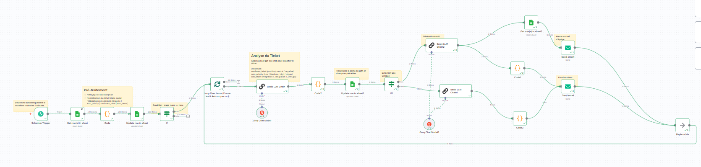

# 📧 Helpdesk Automation Workflow avec n8n et Groq

## 📖 Description
Ce projet présente un **workflow intelligent de gestion des tickets Helpdesk** développé avec **n8n** et le LLM **Groq**.  
L’objectif est d’automatiser la classification des tickets et la génération d’emails personnalisés afin d’améliorer la réactivité et la satisfaction client.  

Le workflow :
- Récupère les tickets enregistrés dans **Google Sheets**  
- Nettoie et normalise les données des tickets  
- Utilise un **LLM Groq** pour analyser chaque ticket :  
  - Détection du **sentiment** (positif, neutre, négatif)  
  - Attribution d’une **priorité automatique** (Low, Medium, High, Urgent)  
  - Orientation vers l’**équipe concernée** (Intégration 1, Intégration 2, DevOps)  
- Génère un **email personnalisé** pour le client :  
  - Email standard → cas non critique  
  - Email urgent + alerte manager → cas critique  
- Met à jour automatiquement le **Google Sheet** avec les informations enrichies  

---

## ⚙️ Technologies utilisées
- **n8n** → orchestration du workflow  
- **Groq LLM** → classification et génération des emails  
- **Google Sheets API** → stockage et récupération des tickets  
- **SMTP** (Gmail/Outlook) → envoi des emails  
- **JavaScript (Function Item Nodes)** → parsing et pré-traitement des données  

---

## 🚀 Fonctionnalités principales
- 🔍 **Détection automatique des cas critiques** (Urgent + négatif)  
- ✉️ **Génération d’emails personnalisés** pour chaque client  
- 📊 **Mise à jour en temps réel** du Google Sheet avec enrichissement des tickets  
- ⚠️ **Alerte envoyée aux managers** en cas de ticket critique  
- 🔁 Traitement **automatisé et récurrent** grâce au Schedule Trigger  

---

## 📷 Aperçu du workflow



---

## 🛠️ Installation et utilisation
1. Cloner le dépôt :
   ```bash
   git clone https://github.com/ton-user/helpdesk-automation-n8n.git
   cd helpdesk-automation-n8n
